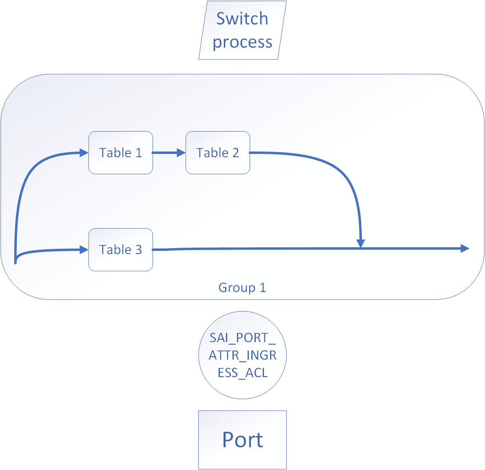
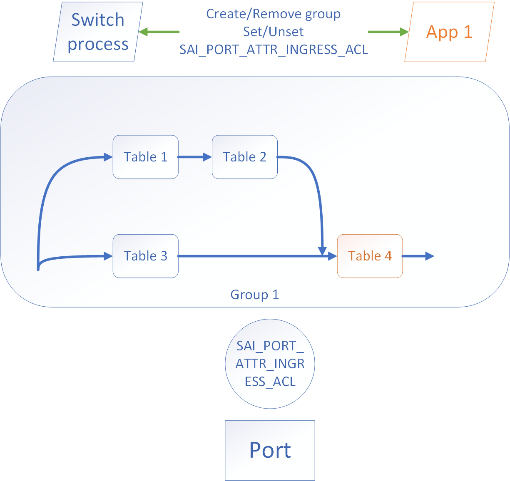
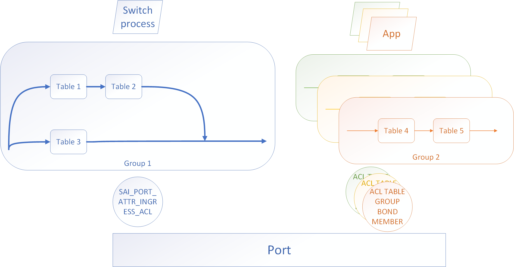

Distributed ACL Management
-------------------------------------------------------------------------------
 Title       | Distributed ACL Management
-------------|-----------------------------------------------------------------
 Authors     | Nvidia
 Status      | In review
 Type        | Standards track
 Created     | 09/23/2020
 SAI-Version | 1.6.2
-------------------------------------------------------------------------------

## Overview
SAI ACL model is described in SAI-Proposal-ACL-1.md.
It provides the API for managing multiple switch forwarding policies as a group of tables.
This works perfectly fine with a centralized application in control of all tables.

However, when moving to an architecture where multiple applications are responsible for their own network fuction, the current model creates an unnecessary depemdency.
There is always a sibgle ownber of the binding between the object (port, router interface etc.) and the ACL table group.
It results in a requirement for a contract between an external application and an owner of table group to create and share the group on demand.
Removal of the table group needs to be also synchronized between all application and the group owner, e.g. when it is no longer used.

## Multi Application Model

The goal of this proposal is to remove that contract between the applications using ACL and the table group owner.
It is done by making it possible to bind not one, but many ACL table groups to the same SAI object.

## Key Considerations

1. This API does not deprecate exising group binding, but provides an enhancement easier way to add new policies.
2. SAI objects used to bind to still need to be shared, but those are created by user explicitly, making it a contract between an external app and a user.
3. Binding to switch object is not yet supported (current SAI API restricts passing switch obect as an attribute).
4. The order of the table groups (implemented with their priorities) is resolved at the higher level by applications.
5. The old binding method takes precedence in terms of priority over the groups using the new API.
6. The order of applying two groups with the same priority is undefined.

## The ACL Table Group Bond API

    /**
     * @brief Attribute Id for ACL Table Group Bond Member
     */
    typedef enum _sai_acl_table_group_bond_member_attr_t
    {
        /**
         * @brief Start of attributes
         */
        SAI_ACL_TABLE_GROUP_BOND_MEMBER_ATTR_START,

        /**
         * @brief Bind object ID
         *
         * Mandatory object ID to bind to.
         *
         * @type sai_object_id_t
         * @flags MANDATORY_ON_CREATE | CREATE_ONLY
         * @objects SAI_OBJECT_TYPE_PORT, SAI_OBJECT_TYPE_LAG, SAI_OBJECT_TYPE_ROUTER_INTERFACE, SAI_OBJECT_TYPE_VLAN
         */
        SAI_ACL_TABLE_GROUP_BOND_MEMBER_ATTR_BIND_OBJECT_ID = SAI_ACL_TABLE_GROUP_BOND_MEMBER_ATTR_START,

        /**
         * @brief ACL Table Group ID
         *
         * Mandatory object ID of the table group.
         *
         * @type sai_object_id_t
         * @flags MANDATORY_ON_CREATE | CREATE_ONLY
         * @objects SAI_OBJECT_TYPE_ACL_TABLE_GROUP
         */
        SAI_ACL_TABLE_GROUP_BOND_MEMBER_ATTR_GROUP_ID,

        /**
         * @brief ACL stage
         *
         * @type sai_acl_stage_t
         * @flags MANDATORY_ON_CREATE | CREATE_ONLY
         */
        SAI_ACL_TABLE_GROUP_BOND_MEMBER_ATTR_ACL_STAGE,

        /**
         * @brief End of attributes
         */
        SAI_ACL_TABLE_GROUP_BOND_MEMBER_ATTR_END,

        /** Custom range base value */
        SAI_ACL_TABLE_GROUP_BOND_MEMBER_ATTR_CUSTOM_RANGE_START = 0x10000000,

        /** End of custom range base */
        SAI_ACL_TABLE_GROUP_BOND_MEMBER_ATTR_CUSTOM_RANGE_END

    } sai_acl_table_group_bond_member_attr_t;

## Usage example

Regardless of which method is used, the flow is the same:

    // CREATE AN INGRESS ACL TABLE GROUP
    sai_object_id_t acl_grp_id1 = NULL;
    acl_grp_attr[0].id = SAI_ACL_TABLE_GROUP_ATTR_ACL_STAGE;
    acl_grp_attr[0].value.s32 = SAI_ACL_STAGE_INGRESS;

    acl_grp_attr[1].id = SAI_ACL_TABLE_GROUP_ATTR_ACL_BIND_POINT_TYPE_LIST;
    acl_grp_attr[1].value.objlist.count = 1;
    acl_grp_attr[1].value.objlist.list[0] = SAI_ACL_BIND_POINT_TYPE_PORT;

    acl_grp_attr[2].id = SAI_ACL_TABLE_GROUP_ATTR_TYPE;
    acl_grp_attr[2].value.s32 = SAI_ACL_TABLE_GROUP_SEQUENTIAL;

    saistatus = sai_acl_api->create_acl_table_group(&acl_grp_id1, 2, acl_grp_attr);
    if (saistatus != SAI_STATUS_SUCCESS) {
        return saistatus;
    }

    // Create an ACL table *acl_table_id3* , to be part of this group *acl_grp_id1*
    sai_object_id_t acl_table_id3 = NULL;
    acl_attr_list[0].id = SAI_ACL_TABLE_ATTR_ACL_STAGE;
    acl_attr_list[0].value.s32 = SAI_ACL_STAGE_INGRESS;

    acl_attr_list[1].id = SAI_ACL_TABLE_GROUP_ATTR_ACL_BIND_POINT_TYPE_LIST;
    acl_attr_list[1].value.objlist.count = 1;
    acl_attr_list[1].value.objlist.list[0] = SAI_ACL_BIND_POINT_TYPE_PORT;

    acl_attr_list[2].id = SAI_ACL_TABLE_ATTR_FIELD_SRC_MAC;
    acl_attr_list[2].value.booldata = True;

    saistatus = sai_acl_api->create_acl_table(&acl_table_id3, 4, acl_attr_list);
    if (saistatus != SAI_STATUS_SUCCESS) {
        return saistatus;
    }
   
    // Create an ACL table entry to deny *src_mac_to_suppress2*
    acl_entry_attrs[0].id = SAI_ACL_ENTRY_ATTR_TABLE_ID;
    acl_entry_attrs[0].value.oid = acl_table_id3;
    acl_entry_attrs[1].id = SAI_ACL_ENTRY_ATTR_PRIORITY;
    acl_entry_attrs[1].value.u32 = 1;
    acl_entry_attrs[2].id = SAI_ACL_ENTRY_ATTR_FIELD_SRC_MAC;
    CONVERT_MAC_TO_SAI_MAC (acl_entry_attrs[2].value.aclfield.data.mac, src_mac_to_suppress2);
    saistatus = sai_acl_api->create_acl_entry(&acl_entry, 3, acl_entry_attrs);
    if (saistatus != SAI_STATUS_SUCCESS) {
        return saistatus;
    }
  
    // Create an acl group member with acl_table_id3 and acl_grp_id1
    sai_object_id_t acl_grp_mem1 = NULL;
    acl_mem_attr[0].id = SAI_ACL_TABLE_GROUP_MEMBER_ATTR_ACL_TABLE_GROUP_ID;
    acl_mem_attr[0].value.s32 = acl_grp_id1;

    acl_mem_attr[1].id = SAI_ACL_TABLE_GROUP_MEMBER_ATTR_ACL_TABLE_ID;
    acl_mem_attr[1].value.s32 = acl_table_id3;

    acl_mem_attr[1].id = SAI_ACL_TABLE_GROUP_MEMBER_ATTR_PRIORITY;
    acl_mem_attr[1].value.s32 = 100;

    saistatus = sai_acl_api->create_acl_table_group_member(&acl_grp_mem1, 2, acl_grp_attr);
    if (saistatus != SAI_STATUS_SUCCESS) {
        return saistatus;
    }

Now, the same table group can be bound to a port in two ways: the old way:
    
    // Bind this ACL group to port1s OID (in the same way we bound ACL table in Example 1)
    port_attr_list.count = 1;
    port_attr_list.id = SAI_PORT_ATTR_INGRESS_ACL;
    port_attr_list.value.oid = acl_grp_id1;
    
    saistatus = sai_port_api->set_port_attribute(port_id, port_attr_list);
    if (saistatus != SAI_STATUS_SUCCESS) {
        return saistatus;
    }

And the external applications can bind the groups this way:

    // Create an acl group bond member
    sai_object_id_t acl_grp_bond_mem1 = NULL;
    acl_grp_bond_mem_attr[0].id = SAI_ACL_TABLE_GROUP_BOND_MEMBER_ATTR_ACL_TABLE_GROUP_ID;
    acl_grp_bond_mem_attr[0].value.s32 = acl_grp_id1;
    
    acl_grp_bond_mem_attr[1].id = SAI_ACL_TABLE_GROUP_BOND_MEMBER_ATTR_BIND_OBJECT_ID;
    acl_grp_bond_mem_attr[1].value.s32 = port_id;
    
    acl_grp_bond_mem_attr[2].id = SAI_ACL_TABLE_GROUP_BOND_MEMBER_ATTR_ACL_STAGE;
    acl_grp_bond_mem_attr[2].value.s32 = SAI_ACL_STAGE_INGRESS;
    
    saistatus = sai_acl_api->create_acl_table_group_bond_member(&acl_grp_bond_mem1, 3, acl_grp_bond_mem_attr);
    if (saistatus != SAI_STATUS_SUCCESS) {
        return saistatus;
    }
