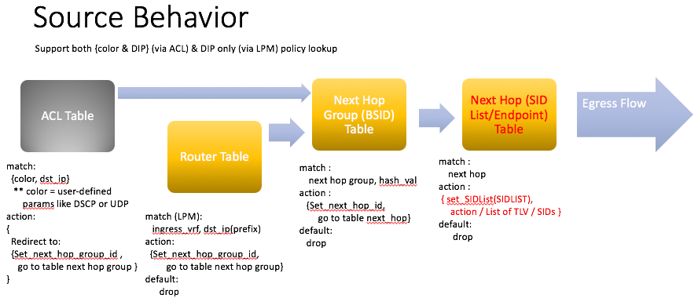
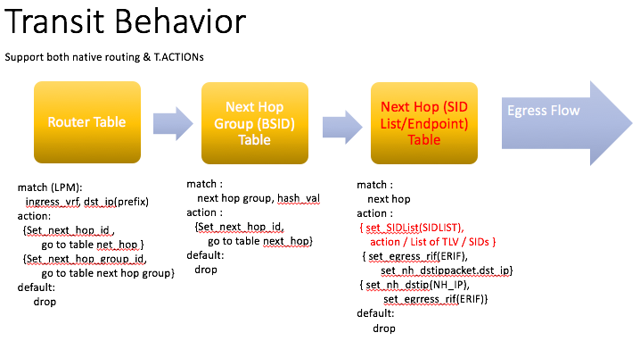
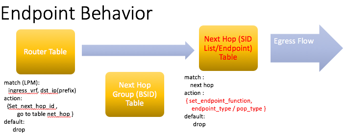

SAI IPv6 Segment Routing Proposal for SAI 1.2.0
-------------------------------------------------------------------------------
 Title       | SAI IPv6 Segment Routing
-------------|-----------------------------------------------------------------
 Authors     | Cavium Inc.
 Status      | In review
 Type        | Standards track
 Created     | 04/14/2017
 Updated     | 05/17/2017
 SAI-Version | 1.2.0

-------------------------------------------------------------------------------

## Overview ##

Segment Routing (SR) allows a node to steer a packet through a controlled set of instructions, called segments, by prepending an SR header to the packet.  A segment can represent any instruction, topological or service-based.  SR allows to enforce a flow through any path (topological, or application/service based) while maintaining per-flow state only at the ingress node to the SR domain.

This document covers IPv6-based Segment Routing as per IETF Drafts:
1. https://tools.ietf.org/html/draft-ietf-6man-segment-routing-header-06.  
2. https://tools.ietf.org/html/draft-filsfils-spring-srv6-network-programming-00
3. https://tools.ietf.org/html/draft-filsfils-spring-segment-routing-policy-00

This specification proposes the following points:
1. Introduce the concept of Segment Routing using IPv6.
2. Introduce behavioral model modifications to support SR source, transit, and endpoint.
3. Introduce SAI APIs to define SR properties including segment and TLV definitions.

## Behavioral Model

To clarify the behaviors of different nodes:
1. Source Node.  This node first encapsulates the SR header on a native IPv6 packet and routes on the outer-most address in SR list.
2. Transit Node.  Typically is unaware of SR header and only does native routing.  But there is an option to append the packet with another SR header to create a stack of SR headers via mechanism similar to Source Node.
3. Endpoint Node.  Last node of the SR header stack.  User can choose an endpoint function to process the packet further such as removing the SR header and natively route.

In order to add IPv6 Segment Routing support, it requires two mechanisms:
1. Way to specify which flows will be marked for SR processing at either source, transit, or endpoint nodes
2. Way to add SR header (source / transit) or modify / remove SR header (endpoint) before normal L2/L3 processing

For the first mechanism, ACL is used to match on any flow characteristics to determine the policy "color" for source node processing.  The color and packet DIP is used in the ACL match lookup to determine the Policy's Binding Segment ID (BSID) which is enabled in the next-hop group table. Alternatively, one can use the LPM route table lookup to just use DIP alone to determine the BSID.  In the transit or endpoint nodes, LPM lookup would be the main mechanism.  The BSID is used in the next-hop group table to group Segment ID Lists (SID Lists).  Weighted or unweighted ECMP hash is configurable to select the possible paths. 

For the second mechanism, the next-hop table is used to manipulate the header.  For endpoint nodes, an entry specifying the endpoint function and parameters is used.  For source or transit nodes that add SR headers, SID lists are represented as objects in the next-hop table.  Afterwards the flow will head to the egress pipeline for futher lookup on the modified packet.  For transit nodes that would do normal L3 processing, the existing pipeline where next-hop is derived will be unchanged.  Thus, the only structural changes needed is in the next-hop table to handle the transit, source, and endpoint actions.

The below figures shows the logic flow for each scenario in the behavioral pipeline to support this.

__Figure 1: Behavioral Model Addition.__

__Figure 2: Source Behavior.__

__Figure 3: Transit Behavior.__

__Figure 4: Endpoint Behavior.__

## API Modification

### Next-Hop Table Modifications
#### Action Parameters

Set SID List Object ID for transit / source behavior to be taken:
    SAI_NEXT_HOP_ATTR_SEGMENTROUTE_SIDLIST_ID

Endpoint Actions to be taken:
    SAI_NEXT_HOP_ATTR_SEGMENTROUTE_ENDPOINT_TYPE
    SAI_NEXT_HOP_ATTR_SEGMENTROUTE_ENDPOINT_POP_TYPE

> Note: Not all endpoint actions included

### SID List Object APIs
#### Vendor Support Advertisement

The switch attribute is a way for vendors to advertise device support include the number of segments and TLV types supported

    SAI_SWITCH_ATTR_SEGMENTROUTE_MAX_SID_DEPTH
    SAI_SWITCH_ATTR_SEGMENTROUTE_TLV_TYPE

> Note: NSH Carrier and Padding TLVs were not included in this first draft

#### Action Parameters

Transit or Source Action to be taken with policy

    SAI_SEGMENTROUTE_SIDLIST_ATTR_TYPE

SID List Action to be taken:

    SAI_SEGMENTROUTE_SIDLIST_TYPE_INSERT
    SAI_SEGMENTROUTE_SIDLIST_TYPE_ENCAPS

List of DIP segments or TLVs to be added

    SAI_SEGMENTROUTE_SIDLIST_ATTR_SEGMENT_LIST
    SAI_SEGMENTROUTE_SIDLIST_ATTR_TLV

### Segment Route Counter Support

> Note: No counters included in first draft

### APIs

To start with, the basic create/remove entry and set/get attributes APIs are included

    create_segmentroute_sidlist;
    remove_segmentroute_sidlist;
    set_segmentroute_sidlist_attribute;
    get_segmentroute_sidlist_attribute;
    create_segmentroute_sidlists;
    remove_segmentroute_sidlists;

## Examples ##
### Example 1 - SR Source / Transit
The following example
1. Creates a Next-Hop Group (BSID)
2. Creates an ACL entry to specify a specific flow to bind to a Next-Hop Group (BSID)
3. Writes SID List Object to add 3 Segments and an Ingress Node TLV  
4. Create Next-Hop Group Member / Next-Hop Object bound to a SID List Object 

<b></b>

    switch_id = 0;
    nhg_entry_attrs[0].id = SAI_NEXT_HOP_GROUP_ATTR_TYPE;
    nhg_entry_attrs[0].value.u32 = SAI_NEXT_HOP_GROUP_TYPE_ECMP;
    saistatus = sai_v6sr_api->create_next_hop_group(&nhg_id, switch_id, 1, nhg_entry_attrs);
    if (saistatus != SAI_STATUS_SUCCESS) {
        return saistatus;
    }

    acl_entry_attrs[0].id = SAI_ACL_ENTRY_ATTR_TABLE_ID;
    acl_entry_attrs[0].value.oid = acl_table_id2;
    acl_entry_attrs[1].id = SAI_ACL_ENTRY_ATTR_PRIORITY;
    acl_entry_attrs[1].value.u32 = 1;
    acl_entry_attrs[2].id = SAI_ACL_ENTRY_ATTR_FIELD_SRC_IPV6;
    CONVERT_STR_TO_IPV6(acl_entry_attrs[2].value.aclfield.data.ip6, "2001:db8:85a3::8a2e:370:7334");
    acl_entry_attrs[3].id = SAI_ACL_ENTRY_ATTR_ACTION_REDIRECT; 
    acl_entry_attrs[3].value.aclfield.data.u32 = nhg_id;
    saistatus = sai_acl_api->create_acl_entry(&acl_entry, 4, acl_entry_attrs);
    if (saistatus != SAI_STATUS_SUCCESS) {
        return saistatus;
    }

    v6sr_entry_attrs[0].id = SAI_SEGMENTROUTE_SIDLIST_ATTR_SEGMENT_LIST
    v6sr_entry_attrs[0].value.objlist.count = 3;
    CONVERT_STR_TO_IPV6(v6sr_entry_attrs[0].value.objlist.list[0], "2001:db8:85a3::8a2e:370:7334");
    CONVERT_STR_TO_IPV6(v6sr_entry_attrs[0].value.objlist.list[1], "2001:db8:85a3::8a2e:370:2345");
    CONVERT_STR_TO_IPV6(v6sr_entry_attrs[0].value.objlist.list[2], "2001:db8:85a3::8a2e:370:3456");
    v6sr_entry_attrs[1].id = SAI_SEGMENTROUTE_SIDLIST_ATTR_TLV_LIST;
    v6sr_entry_attrs[1].value.objlist.count = 1;
    v6sr_entry_attrs[1].value.objlist.list[0].tlv_type = SAI_TLV_TYPE_INGRESS;
    CONVERT_STR_TO_IPV6(v6sr_entry_attrs[1].value.objlist.list[0].ingress_node, "2001:db8:85a3::8a2e:370:9876");
    v6sr_entry_attrs[2].id = SAI_SEGMENTROUTE_SIDLIST_ATTR_TYPE;
    v6sr_entry_attrs[2].value = SAI_SEGMENTROUTE_SIDLIST_TYPE_ENCAPS; 
    saistatus = sai_v6sr_api->create_segmentroute_sidlist(&sidlist_id, switch_id, 3, v6sr_entry_attrs);
    if (saistatus != SAI_STATUS_SUCCESS) {
        return saistatus;
    }

    nh_entry_attrs[0].id = SAI_NEXT_HOP_ATTR_TYPE;
    nh_entry_attrs[0].value.u32 = SAI_NEXT_HOP_TYPE_SEGMENTROUTE_SIDLIST; 
    nh_entry_attrs[1].id = SAI_NEXT_HOP_ATTR_SEGMENTROUTE_SIDLIST_ID;
    nh_entry_attrs[1].value.oid = sidlist_id; 
    saistatus = sai_v6sr_api->create_next_hop(&nh_id, switch_id, 2, nh_entry_attrs);
    if (saistatus != SAI_STATUS_SUCCESS) {
        return saistatus;
    }

    nhgm_entry_attrs[0].id = SAI_NEXT_HOP_GROUP_MEMBER_ATTR_NEXT_HOP_GROUP_ID;
    nhgm_entry_attrs[0].value.oid = nhg_id; 
    nhgm_entry_attrs[1].id = SAI_NEXT_HOP_GROUP_MEMBER_ATTR_NEXT_HOP_ID;
    nhgm_entry_attrs[1].value.oid = nh_id; 
    saistatus = sai_v6sr_api->create_next_hop_group_member(&nhgm_id, switch_id, 2, nhgm_entry_attrs);
    if (saistatus != SAI_STATUS_SUCCESS) {
        return saistatus;
    }

### Example 2 - SR Endpoint 
The following example creates an Endpoint entry to match on incoming DIP and do a basic endpoint behavior with PSP

    nh_entry_attrs[0].id = SAI_NEXT_HOP_ATTR_TYPE;
    nh_entry_attrs[0].value.u32 = SAI_NEXT_HOP_TYPE_SEGMENTROUTE_ENDPOINT; 
    nh_entry_attrs[1].id = SAI_NEXT_HOP_ATTR_SEGMENTROUTE_ENDPOINT_POP_TYPE;
    nh_entry_attrs[1].value.u32 = SAI_NEXT_HOP_ENDPOINT_POP_TYPE_PSP;
    nh_entry_attrs[2].id = SAI_NEXT_HOP_ATTR_SEGMENTROUTE_ENDPOINT_TYPE;
    nh_entry_attrs[2].value.u32 = SAI_NEXT_HOP_ENDPOINT_TYPE_E;

    saistatus = sai_v6sr_api->create_next_hop(&nh_id, switch_id, 3, nh_entry_attrs);
    if (saistatus != SAI_STATUS_SUCCESS) {
        return saistatus;
    }

    route_entry.switch_id = switch_id_1;
    route_entry.vr_id = vr_id_1;
    route_entry.destination.addr_family = SAI_IP_ADDR_FAMILY_IPV6;
    CONVERT_STR_TO_IPV6(route_entry.destination.addr.ip6, "2001:db8:85a3::8a2e:370:0001");
    CONVERT_STR_TO_IPV6(route_entry.destination.mask.ip6, "FFFF::FFFF");
    route_entry_attrs[0].id = SAI_ROUTE_ENTRY_ATTR_NEXT_HOP_ID;
    route_entry_attrs[0].value.u32 = nh_id; 

    saistatus = sai_v6sr_api->create_route_entry(route_entry, 1, route_entry_attrs);
    if (saistatus != SAI_STATUS_SUCCESS) {
        return saistatus;
    }

## References ##
1. https://tools.ietf.org/html/draft-ietf-6man-segment-routing-header-06
2. https://tools.ietf.org/html/draft-filsfils-spring-srv6-network-programming-00
3. https://tools.ietf.org/html/draft-filsfils-spring-segment-routing-policy-00
