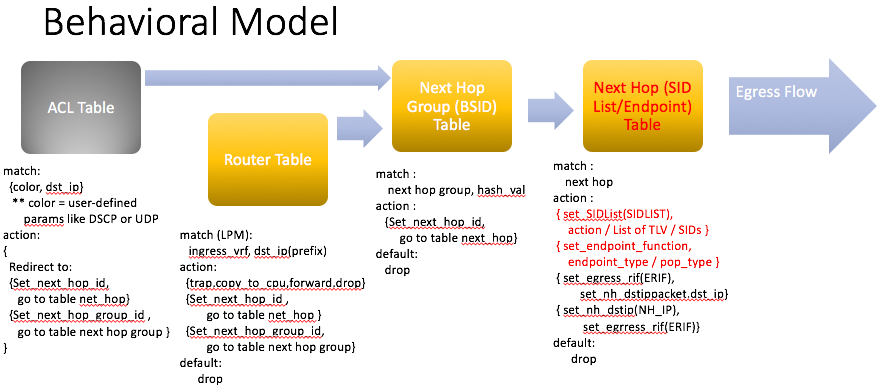

#SAI IPv6 Segment Routing Proposal for SAI 1.2.0
-------------------------------------------------------------------------------
 Title       | SAI IPv6 Segment Routing
-------------|-----------------------------------------------------------------
 Authors     | Cavium Inc.
 Status      | In review
 Type        | Standards track
 Created     | 04/14/2017
 Updated     | 04/14/2017
 SAI-Version | 1.2.0

-------------------------------------------------------------------------------

## Overview ##

Segment Routing (SR) allows a node to steer a packet through a controlled set of instructions, called segments, by prepending an SR header to the packet.  A segment can represent any instruction, topological or service-based.  SR allows to enforce a flow through any path (topological, or application/service based) while maintaining per-flow state only at the ingress node to the SR domain.

This document covers IPv6-based Segment Routing as per IETF Draft: https://tools.ietf.org/html/draft-ietf-6man-segment-routing-header-06.  

This specification proposes the following points:
1. Introduce the concept of Segment Routing using IPv6.
2. Introduce behavioral model modifications to support SR origination, transit, and termination.
3. Introduce SAI APIs to define SR origination properties including segment and TLV definitions.

## Behavioral Model

In order to add IPv6 Segment Routing, it requires two mechanisms:
1. Way to specify which flows will be marked for SR origination
2. Way to add SR header (origination), remove SR header (termination), manipulate SR header to use next segment (transit) before normal IPv6 Route lookup or just do normal IPv6 Routing

For the first mechanism, ingress ACL is used to match on specific native IPv6 flows to originate a SR header due to n-tuple match flexbility.  From ACL match, it would derive a segment_id to pass into the Segment Route Table.

For the second mechanism, the Segment Route Table would be used to manipulate the SR header information before IPv6 Route lookup.  This would require two mechanisms:
1. Way to specific what segment and/or TLV information would be added in the origination case.  This will be programmed via SAI APIs into a match/action within the Segment Route Table.
2. Way to identify if ingress packet has a SR header existing and SR DIP is my IP address for the transit and termination cases.  This is done via the segment_flag metadata, which will be set via a previous element such as the parser.

Within the Segment Route Table, if a match on the segment_id is found, the resulting action would add the programmed SR header to the packet so the subsequent route lookup will be on the SR header segment DIP instead of the native DIP.  If segment_flag is set, then the logic will replace the outer IP with the next segment information or decapsulate the SR header if it is the last segment.

With this model, only SR origination case requires user API interaction to configure.  Transit and Termination behavior, in current form, is implicit.

Figure 1 shows the additional logic between the ACL and Router Table in the behavioral pipeline to support this.

__Figure 1: Behavioral Model Addition.__

## API Modification

### ACL Table Modification
Adding an additional ACL action / value of SAI_ACL_ACTION_TYPE_SET_SEGMENT_ID to define the segment_id for native packets to be matched upon for SR origination in the next Segment Route Table lookup

### Segment Route Table APIs for Origination
#### Vendor Support Advertisement

Included is also a way for vendors to advertise devcie support include type of SR supported, the number of segments and TLV types that can be originated

    SAI_SEGMENTROUTE_ENTRY_ATTR_HEADERTYPE_SUPPORTED
    SAI_SEGMENTROUTE_ENTRY_ATTR_NUM_SEGMENTS_SUPPORTED
    SAI_SEGMENTROUTE_ENTRY_ATTR_TLV_TYPE_SUPPORTED

#### Match Parameter

The sole match parameter it the segment ID passed from the ACL lookup
    SAI_SEGMENTROUTE_ENTRY_ATTR_SEGMENT_ID

#### Action Parameters

Define what kind of segment route type to originate upon (IPv6 or MPLS):
    SAI_SEGMENTROUTE_ENTRY_ATTR_HEADERTYPE
        SAI_SEGMENTROUTE_FAMILY_IPV6,
        SAI_SEGMENTROUTE_FAMILY_MPLS

Number of segments to be add:
    SAI_SEGMENTROUTE_ENTRY_ATTR_NUM_SEGMENTS

List of DIP/SIP pair to be added.  Elements in list must match number in SAI_SEGMENTROUTE_ENTRY_ATTR_NUM_SEGMENTS:
    SAI_SEGMENTROUTE_ENTRY_ATTR_SEGMENT_LIST
        typedef struct _sai_segmentroute_address_t {
            sai_ip6_t ip6_dip;
            sai_ip6_t ip6_sip;
        } sai_segmentroute_address_t;

Number of TLVs to be add:
    SAI_SEGMENTROUTE_ENTRY_ATTR_NUM_TLVS

List of TLVs to be added.  Elements in list must match number in SAI_SEGMENTROUTE_ENTRY_ATTR_NUM_TLVS:
    SAI_SEGMENTROUTE_ENTRY_ATTR_TLV
        tlv_family
            SAI_SEGMENTROUTE_TLV_TYPE_INGRESS,
            SAI_SEGMENTROUTE_TLV_TYPE_EGRESS,
            SAI_SEGMENTROUTE_TLV_TYPE_OPAQUE,
            SAI_SEGMENTROUTE_TLV_TYPE_PADDING,
            SAI_SEGMENTROUTE_TLV_TYPE_HMAC,
            SAI_SEGMENTROUTE_TLV_TYPE_NSH_CARRIER,
        union
????

#### APIs

    sai_create_segmentroute_fn create_segmentroute;
    sai_remove_segmentroute_fn remove_segmentroute;
    sai_set_segmentroute_attribute_fn set_segmentroute_attribute;
    sai_get_segmentroute_attribute_fn get_segmentroute_attribute;

## Examples ##
### Example 1 - SR Origination
The following example creates an ACL entry to specify a specific flow to bind to segment_id = 1 as well as creating the corresponding entry in the Segment Routing Table to add 3 Segments and an Ingress Node TLV

    acl_entry_attrs[0].id = SAI_ACL_ENTRY_ATTR_TABLE_ID;
    acl_entry_attrs[0].value.oid = acl_table_id2;
    acl_entry_attrs[1].id = SAI_ACL_ENTRY_ATTR_PRIORITY;
    acl_entry_attrs[1].value.u32 = 1;
    acl_entry_attrs[2].id = SAI_ACL_ENTRY_ATTR_FIELD_SRC_IPV6;
    CONVERT_STR_TO_IP(acl_entry_attrs[2].value.aclfield.data.ip6, "2001:db8:85a3::8a2e:370:7334");
    acl_entry_attrs[3].id = SAI_ACL_ACTION_TYPE_SET_SEGMENTROUTE; 
    acl_entry_attrs[3].value.aclfield.data.u32 = 1;
    saistatus = sai_acl_api->create_acl_entry(&acl_entry, 4, acl_entry_attrs);
    if (saistatus != SAI_STATUS_SUCCESS) {
        return saistatus;
    }

???????? For enums, what should I use??  For structs, what should I use??

    v6SR_entry_attrs[0].id = SAI_SEGMENTROUTE_ENTRY_ATTR_HEADERTYPE
    v6SR_entry_attrs[0].value.u32... = SAI_SEGMENTROUTE_FAMILY_IPV6
    v6SR_entry_attrs[1].id = SAI_SEGMENTROUTE_ENTRY_ATTR_SEGMENT_ID
    v6SR_entry_attrs[1].value.u32... = 1
    v6SR_entry_attrs[2].id = SAI_SEGMENTROUTE_ENTRY_ATTR_NUM_SEGMENTS
    v6SR_entry_attrs[2].value.u32 = 3
    v6SR_entry_attrs[3].id = SAI_SEGMENTROUTE_ENTRY_ATTR_SEGMENT_LIST
    v6SR_entry_attrs[3].value.u32... =  list ...
    v6SR_entry_attrs[4].id = SAI_SEGMENTROUTE_ENTRY_ATTR_TLV
    v6SR_entry_attrs[4].value.u32... = TO... list SAI_SEGMENTROUTE_TLV_TYPE_INGRESS

    saistatus = sai_v6sr_api->create_segmentroute(&v6sr_entry, 5, v6SR_entry_attrs);
    if (saistatus != SAI_STATUS_SUCCESS) {
        return saistatus;
    }

## References ##
1. Most Recent IPv6 Segment Routing IETF Draft: https://tools.ietf.org/html/draft-ietf-6man-segment-routing-header-06

